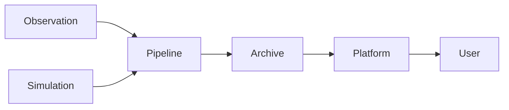

:::::::::::::::::::::::::::::::::::::: questions 

- What does Big Data mean?
- What are some common barriers to working with big data?

::::::::::::::::::::::::::::::::::::::::::::::::

::::::::::::::::::::::::::::::::::::: objectives

- Recognise that “big data” is context-dependent (size, complexity, velocity).
- Identify when your own research crosses into “big data” territory.
- Identify common technical and practical barriers (compute, storage, transfer, tooling).
- Reflect on which barriers are most relevant to your own research context.

::::::::::::::::::::::::::::::::::::::::::::::::

## Big Data in Astronomy: Scale, Barriers, and Implications

## What is big data?

Despite the name, big data is not all about the petabytes.
In fact, the "big" in big data is more about the scale of the problems caused, than the size of the data itself.

::: callout

Big data begins when your normal way of working breaks.

:::

Essentially you know you need to engage in big data thinking when your establisehd workflows break.
Sometimes the solutions require new hardware or software, but sometimes you also need to change how you think about a problem or even change the questions that you are asking.
Your workflows may need changing or updating when any of the items listed in our example workflow become difficult.
For example, our normal ways of working could break because:

1. The data are too large to store on your local machine,
2. The cleaning/filtering process takes many hours to complete,
3. The data has high dimensionality or connectivity, and is difficult to summarize or visualise with existing tools,
4. Your data can't be presented as a table or image, and thus is difficult to share in a publication.

Each of these breakdowns have simple solutions with significant costs:

1. You work on a subset of the available data. You get results but there is a question around generalization. Small effects and subtle features are not evident in smaller populations, and you miss potential discoveries.
2. You follow "standard practice" to do a single pass data processing step. When you find errors or strange features in your processed data you employ post-hoc analysis 'corrections' to try and account for these features. It becomes difficult to clearly separate real features from data processing artefacts. You (and others) are less confident in your results.
3. You only view/compare a few features at a time to reduce complexity. Your results are limited to correlations between the subset of feature combinations that you have decided to use. Multi-colinear relationships, or even non-linear relationships are not explored and you miss out on a deeper insight into the problem at hand.
4. You present snapshots of your data in your publication, and leave a data sharing note that asks people to contact you in order to have access to the data you used. (1 year later you move institutes and loose that particular HDD).


The "solutions" above are clearly not ideal, but, sadly, they are more common than you would hope.
You won't find such honest descriptions or reasoning in most papers, but talk to someone at a conference and you'll soon see how common these solutions are.

::: challenge

## Tools of the trade

In your groups discuss:
1. What software do you use in your research for the various activities listed in our workflow?
2. What kinds of big data would make these tools less or not useful?
3. Do you have alternatives that you could swap to if you needed to work on big data?

Use [Wooclap] to list the name of your tool, and we'll select some to explore further as a class.

:::


### What actually goes wrong?

Working with big data is not just difficult, it is different.
The challenge is not that tasks become slower, but that some things stop being possible altogether.
The great news is that the converse is often also true - if you can solve some big data problems, you start to unlock new capabilities.

When you have big data problems the following things happen:

1. You can't open or inspect your data
    * Files are too large. Data is distributed.
    * You cannot "just take a look".
2. You can't iterate quickly
    * A small change might require hours or days to re-run.
    * Exploration becomes expensive.
3. You can't rerun your analysis reliably
    * Pipelines become complex, fragile, and hard to reproduce.
4. You can’t keep everything
    * Intermediate results, temporary files, and even raw data may be discarded or inaccessible.

With big data, you stop interacting with the data directly.
Instead, you are interacting with the process.

Our new science workflow now looks like this:

```mermaid

flowchart LR;
    accTitle: {Our new science workflow.}
    addDescr: {An alternative science workflow consisting of data input, a fully automated workflow which out puts our results.}
    A["Data"];
    workflow["(Automated) Workflow"];
    R["Results"];
    A-->workflow-->R;
```

We have taken two steps forward in that we now have an automated and hopefully robust and reproducible workflow that we can rely on.
However we also have taken a step back in that we are now less directly working with the data at each stage.


::: callout

## Big Data in the AT20G survey (ca 2010)

The Australia Telescope 20GHz ([AT20G]) survey was an ambitious survey inspired by a new wide-band correlator that was installed at the Australia Telescope Compact Array.
The correlator is the piece of hardware that combines signals from different parts of a radio telescope, digitizes the product, and records it to disk.
At the time the ATCA systems had a recording bandwidth of only 128MHz, while this new wideband correlator had a whopping 8GHz bandwidth.
Since sensitivity is proportional to bandwidth times integration time, this represented a portential **64x decrease** in survey time for a fixed sensitivity goal.
This new correlator made it possible to conduct a survey of the southrn sky at 20GHz with weeks of observations rather than years.

The new correlator made many sacrificies to achieve the extremely large bandwidth, some of these include the lack of delay tracking, and an analogue signal mixer, meaning that the visibilities that were produced could not be processed using existing software.
The analogue signal mixer meant that the 16 delay channels were not evenly spaced, so standard imaing techniques (fast fourier inversion) were not appropriate.
Additionally, the lack of delay tracking meant that the telescope could only observe at fixed hour angles (angle from the meridian), requiring a new data collection techinuqe to be used to eventually cover the entire sky.

Since the calibration and imaging techniques were new, (and the resulting images were not able to be CLEANed) follow-up observations were needed to confirm the reality, brightness, location, and morphology of all detected objects.
The number of detected sources was small enough that these follow-up observations were conducted with traditional observing techniques and were done at 5GHz, 8GHz, and 20GHz.

The total volume of data collected by the AT20G was not that different from other observations (? amount?), so why is this project being used as a case-study for a big data workshop?
This is because we had to employ big data thinking to bring this project to completion:

1. Lack of delay tracking meant that point and shoot style mapping had to be replaced with an on-the-fly mapping strategy. Furthermore, this meant that the normal calibration scheme couldn't be used and we had to develop new techniques for observing and using calibrator sources. The big data thinking here is a new approach to observing / calibration techniques.
2. The wideband correlator collected visibilities, but with features that broke the assumptions of existing calibration and imaging software. Thus bespoke software was required to both calibrate the data, and create maps of the sky.
3. The on-the-fly mapping technique was an already known technique used on other instruments, but the standard software for ATCA data processing didn't support this mode, requiring new software to be built.
4. Whilst the 20GHz component of the survey was blind (no prior information), the 5/8GHz components were highly informed by the 20GHz results and thus not blind. This restricted the statistical tests that could be done using the population of sources at each of these frequencies, requiring careful communication and presentation of results.
5. The final images that were created for the survey couldn't be analysed or interpreted in the same way as traditional images. Ultimate it was decided that releasing these images would cause more confusion than real science and so they were withheld. The plan was to create a web service that would allow people to extract meaningful information from these images using custom analysis techniques. (It never happened).

:::

### Common big data patterns in astronomy

Modern astronomy is a data-intensive science.
In many ways astronomy is leading other domains in it's embrace of new technologies and techniques thanks to telescopes and simulations that produce data at scales and rates that fundamentally change how research is done.
Some common big data patterns that have been adopted in astronomy are:

1. Streaming data (eg, time-domain astronomy)
    * Data arrives continuously.
    * Decisions must be made in real time.
    * You cannot store everything.
    * You cannot inspect everything by hand.
2. Data that cannot be downloaded
    * Many datasets are simply too large to move.
    * Analysis happens where the data lives.
    * Attach an HPC to an archive, rather than the inverse.
3. Pipelines as the primary interface
    * The raw data is rarely used directly.
    * Complex pipelines produce calibrated 'science ready' data products.
4. Long-lived datasets and data releases
    * Results depend on which version of the data you used, and how it was processed.
    * Data and software versioning becomes very important for reproducibility.

As a result we have a frequent data access pattern, where the user is far from the raw data and will often only retrieve a filtered subset of the processed data for their particular research need.





### Why this matters to you
You may not be working with petabytes of data.
But you are likely already encountering the same underlying problems:

- combining multiple datasets
- re-running analyses late in your project
- scaling an approach that worked on a small sample

::: challenge

## Big data projects

Each group has been given a selection of case studies drawn from Astronomy research past and present.

**Part 1**: Choose one of the case studies and identify some difficulties faced or limiting factors for this project in relation to:

* Collecting, storing or transporting data
* Filtering, calibrating, or processing data
* Visualising data
* Communicating results
 
**Part 2**: Discuss some of the tools that were used in or developed for this project. 

**Part 3**: For completed projects, if you were to re-run this project again today, what would you do differently, what would be easier, and would you still consider the project a big data project?

Join the shared [GoogleDoc], locate the tab relevant to the case study you have worked on and record your answers.

:::

::: tab

### GLEAM

details

### GRB followup (VLA / ATCA)

details

### FRB detector (ASKAP)

details

### Digitising sky plates

details

### 2DF / spectroscopic surveys

details

### Some simulation work

details more

:::


[AT20G]: https://ui.adsabs.harvard.edu/abs/2010MNRAS.402.2403M/abstract