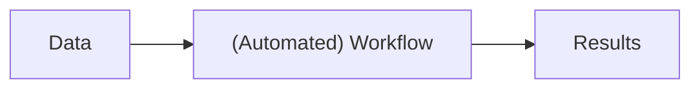
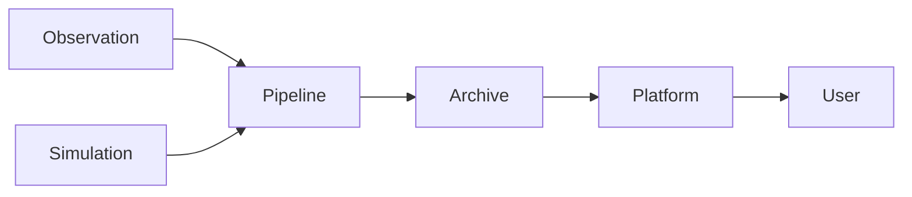

:::::::::::::::::::::::::::::::::::::: questions 

- What does Big Data mean?
- What are some common barriers to working with big data?

::::::::::::::::::::::::::::::::::::::::::::::::

::::::::::::::::::::::::::::::::::::: objectives

- Recognise that “big data” is context-dependent (size, complexity, velocity).
- Identify when your own research crosses into “big data” territory.
- Identify common technical and practical barriers (compute, storage, transfer, tooling).
- Reflect on which barriers are most relevant to your own research context.

::::::::::::::::::::::::::::::::::::::::::::::::

::: instructor

This section is about how big data breaks normal ways of working

:::

## Big Data in Astronomy: Scale, Barriers, and Implications

## What is big data?

Despite the name, big data is not all about the petabytes.
In fact, the "big" in big data is more about the scale of the problems caused, than the size of the data itself.

::: callout

Big data begins when your normal way of working breaks.

:::

Essentially you know you need to engage in big data thinking when your established workflows break.
Sometimes the solutions require new hardware or software, but sometimes you also need to change how you think about a problem or even change the questions that you are asking.
Your workflows may need changing or updating when any of the items listed in our example workflow become difficult.
For example, our normal ways of working could break because:

1. The data are too large to store on your local machine,
2. The cleaning/filtering process takes many hours to complete,
3. The data has high dimensionality or connectivity, and is difficult to summarize or visualise with existing tools,
4. Your data can't be presented as a table or image, and thus is difficult to share in a publication.

::: spoiler

## But I can get around these problems...

Each of these breakdowns have simple solutions with significant costs:

1. You work on a subset of the available data. You get results but there is a question around generalization. Small effects and subtle features are not evident in smaller populations, and you miss potential discoveries.
2. You follow "standard practice" to do a single pass data processing step. When you find errors or strange features in your processed data you employ post-hoc analysis 'corrections' to try and account for these features. It becomes difficult to clearly separate real features from data processing artifacts. You (and others) are less confident in your results.
3. You only view/compare a few features at a time to reduce complexity. Your results are limited to correlations between the subset of feature combinations that you have decided to use. Multi-colinear relationships, or even non-linear relationships are not explored and you miss out on a deeper insight into the problem at hand.
4. You present snapshots of your data in your publication, and leave a data sharing note that asks people to contact you in order to have access to the data you used. (1 year later you move institutes and loose that particular HDD).

The "solutions" above are clearly not ideal, but, sadly, they are more common than you would hope.
You won't find such honest descriptions or reasoning in most papers, but talk to someone at a conference and you'll soon see how common these solutions are.

:::

### What actually goes wrong?

Working with big data is not just difficult, it is different.
The challenge is not that tasks become slower, but that some things stop being possible altogether.
The great news is that the converse is often also true - if you can solve some big data problems, you start to unlock new capabilities.

When you have big data problems the following things happen:

1. You can't open or inspect your data
    * Files are too large. Data is distributed.
    * You cannot "just take a look".
2. You can't iterate quickly
    * A small change might require hours or days to re-run.
    * Exploration becomes expensive.
3. You can't rerun your analysis reliably
    * Pipelines become complex, fragile, and hard to reproduce.
4. You can’t keep everything
    * Intermediate results, temporary files, and even raw data may be discarded or inaccessible.

With big data, you stop interacting with the data directly.
Instead, you are interacting with the process.

Our new science workflow now looks like this:

We have taken two steps forward in that we now have an automated and hopefully robust and reproducible workflow that we can rely on.
However we also have taken a step back in that we are now less directly working with the data at each stage.

::: callout

## AT20G: A big data problem without "big data"

The AT20G survey used a new wide-band correlator that enabled much faster observations by increasing bandwidth significantly.
Although the total data volume was not unusually large, the project still required big data thinking because it broke existing ways of working:

- Standard calibration and imaging methods no longer worked. 
  - The data did not meet the assumptions of existing software, requiring new processing approaches.
- Existing tools were insufficient
  - Bespoke software had to be developed to process and interpret the data.
- Observing strategies had to change
  - Traditional observing methods were replaced with new techniques to handle how the data were collected.
- Results were harder to validate and communicate
  - Non-standard data products made interpretation and sharing more difficult.

:::

### Common big data patterns in astronomy

Modern astronomy is a data-intensive science.
In many ways astronomy is leading other domains in it's embrace of new technologies and techniques thanks to telescopes and simulations that produce data at scales and rates that fundamentally change how research is done.
Some common big data patterns that have been adopted in astronomy are:

1. Streaming data (eg, time-domain astronomy)
    * Data arrives continuously.
    * Decisions must be made in real time.
    * You cannot store everything.
    * You cannot inspect everything by hand.
2. Data that cannot be downloaded
    * Many datasets are simply too large to move.
    * Analysis happens where the data lives.
    * Attach an HPC to an archive, rather than the inverse.
3. Pipelines as the primary interface
    * The raw data is rarely used directly.
    * Complex pipelines produce calibrated 'science ready' data products.
4. Long-lived datasets and data releases
    * Results depend on which version of the data you used, and how it was processed.
    * Data and software versioning becomes very important for reproducibility.

As a result we have a frequent data access pattern, where the user is far from the raw data and will often only retrieve a filtered subset of the processed data for their particular research need.

### Why this matters to you

You may not be working with petabytes of data.
But you are likely already encountering the same underlying problems:

- combining multiple datasets
- re-running analyses late in your project
- scaling an approach that worked on a small sample

::: challenge

## Big data projects

Each group has been given a selection of case studies drawn from Astronomy research past and present.

Choose a case study and:

1. Identify the *key pressure point* in this project:
   Where does scale, complexity, or time pressure create difficulty?

2. If nothing changes, what fails first?
   Choose one:
   - Storage
   - Compute
   - Data transfer
   - Visualisation
   - Workflow/process
   - Communication/coordination

   Be prepared to justify your choice.

3. What change would you make to address this?
   You can change:
   - The data (what is stored, reduced, or discarded)
   - The workflow (timing, automation, decision-making)
   - The tools (algorithms, infrastructure)
   - The people/process (roles, communication)

4. What new trade-off does your solution introduce?
   (What gets worse when your fix is applied?)

Join the shared [GoogleDoc], locate the tab relevant to the case study you have worked on and record your answers.

If you have time, feel free to complete the above for multiple different projects.

:::

::: tab

### The GLEAM Survey

The GLEAM survey uses the Murchison Widefield Array to image the entire southern sky at low radio frequencies, producing a catalogue of hundreds of thousands of sources from petabyte-scale raw data collected in repeated drift scans across multiple frequency bands. 
The data are processed through a complex imaging and calibration pipeline, but researchers notice that although the images look good, measured source fluxes vary by ~20% between observing nights.
This raises concerns about consistency in calibration, reproducibility of the pipeline, and how systematic errors propagate into the final catalogue used for science.

Learn more at: [Hurley-Walker et. al, 2017](https://doi.org/10.1093/mnras/stw2337), [Wayth et. al, 2015](https://doi.org/10.1017/pasa.2015.26)

### GRB followup with the ATCA and VLA

A gamma-ray burst (GRB) is detected by a space telescope, triggering a rapid multi-wavelength follow-up campaign involving optical, X-ray, and radio observatories.
The radio team must decide within 30 minutes whether to schedule observations, even though incoming data from other facilities arrive asynchronously and in different formats.
In a recent case, the radio afterglow was detected only weeks later, suggesting that earlier observations were missed due to delays in coordination.
The challenge is not data volume, but how to integrate distributed, time-sensitive information to make decisions quickly enough.

Learn more at: [Anderson et. al, 2024](https://doi.org/10.3847/2041-8213/ad85e9)

### FRB Detection with ASKAP

The ASKAP telescope continuously streams radio data at very high rates, which are processed in real time by pipelines that search for short-duration pulses across thousands of dispersion measures. 
Because of storage limitations, only a tiny fraction of candidate events can be saved, and the pipeline must balance sensitivity against false positives.
In practice, the system detects many spurious signals while also missing faint real events, highlighting trade-offs between compute throughput, algorithm performance, and long-term data retention.

Learn more at: [Qiu et al. 2023](https://doi.org/10.1093/mnras/stad1740)

### Digitising Southern Sky Plates

Astronomers are digitising a large archive of photographic sky plates taken over the past century, including unique observations of the southern hemisphere.
The project produces billions of source measurements and long-term light curves, but many plates have incomplete or inconsistent metadata, and calibration across decades is difficult.
As a result, light curves derived from the digitised data show inconsistencies between epochs, raising questions about how to handle uncertain metadata, cross-calibrate observations, and prioritise which data products are reliable enough for scientific use.

Learn more at: [Enke et. al, 2024](https://doi.org/10.1051/0004-6361/202348793)

### 2QZ Spectroscopic Survey

A large spectroscopic survey using the 2dF instrument collects tens of thousands of spectra and derives redshifts to map the large-scale structure of the Universe.
However, not all spectra yield reliable redshifts - around 10-20% are ambiguous or low quality—and different teams applying different quality cuts or analysis choices end up with inconsistent clustering results from the same dataset.
This raises issues around data quality, selection effects, and how analysis pipelines influence scientific conclusions.

Learn more at: [Croom et. al, 2004](https://doi.org/10.1111/j.1365-2966.2004.07619.x)

### Cosmological Galaxy Formation

A research team runs a large cosmological simulation (e.g. IllustrisTNG) to model the formation of galaxies and dark matter structures from the early Universe to today.
The simulation evolves dark matter, gas, stars, and black holes across cosmic time, producing snapshots at many time steps along with catalogues of galaxies, halos, and merger trees.
The full dataset is extremely large (hundreds of terabytes to petabyte scale), so only a subset can be downloaded locally and most analysis must be done through remote APIs or on shared computing systems.
Researchers find that different teams analyse different subsets or derived products, making it difficult to reproduce results or compare analyses consistently.
The challenge becomes deciding what to store, how to provide access, and how to ensure reproducible workflows when the full dataset cannot be easily handled by any individual user.

Learn more at: [Nelson et. al, 2019](https://doi.org/10.1186/s40668-019-0028-x)

:::

[AT20G]: https://ui.adsabs.harvard.edu/abs/2010MNRAS.402.2403M/abstract