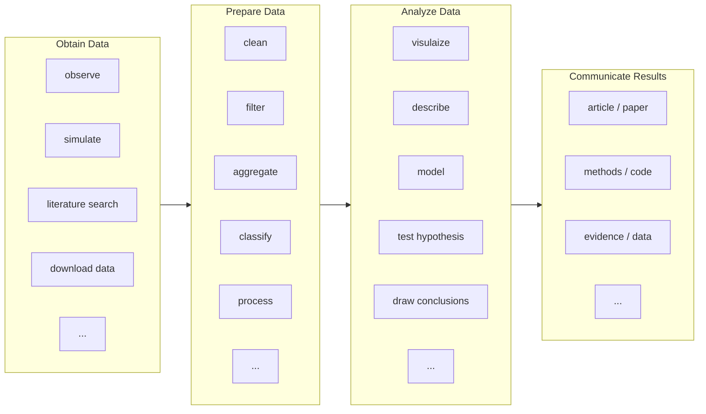

## Introduction

At this HWSA workshop, [ADACS] will be delivering two sessions:

- "Big data handling for reproducible workflows" (Sections 2-4) will be delivered in the first session Friday Afternoon from 1:30-3:30.
- "Workflows and reproducibility in practice" (Section 6) will be delivered on Saturday morning from 11:30-12:30.

Throughout these sessions we will be working in small groups of 3-5 people.
Within your groups you'll often be asked to discuss a topic, summarize your answers, and then use [Wooclap] or a shared [GoogleDoc] to share your answers with the class.

::: challenge

Form into groups of around 4 people, making sure that you have at least one person in your group that you haven't worked with before.

Once you have formed a group, everyone should give a 15 second intro to the group.

:::

## Background

In this workshop we will be returning to the following flow chart as an example of a generic workflow for research:

The workflow above is intentionally generic and hopefully you have experience in doing many of the activities described.
In your research some or all of the above will be done "by hand" (that is, interactively), at least initially, using existing tools and your local machine (your laptop or work desktop).

The advent of "Big Data" in astronomy hasn't fundamentally changed what the above workflow looks like, however it does change how each of the steps are preformed.
This will be the focus of today's workshop:

1. What is big data, and how does it change how I do research?
2. How can we better design, execute, and evaluate workflows?
3. How do we maintain research best practice when working with big data?