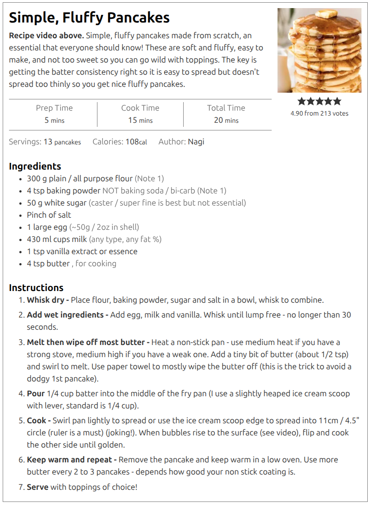
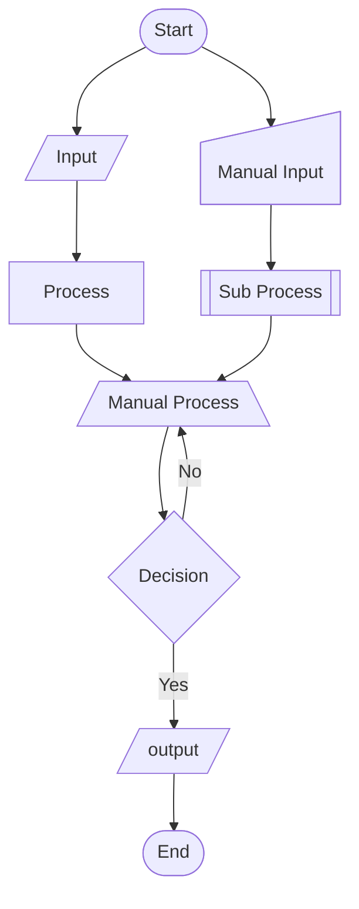
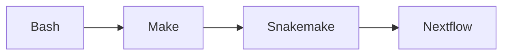

:::::::::::::::::::::::::::::::::::::: questions 

- What Are Workflows and Why Do They Matter?
- How Do I Design a Workflow for my Research?

::::::::::::::::::::::::::::::::::::::::::::::::

::::::::::::::::::::::::::::::::::::: objectives

- Identify common technical and practical barriers (compute, storage, transfer, tooling).
- Reflect on which barriers are most relevant to your own research context.
- Map the key steps in your own research process as a workflow.
- Identify opportunities to structure or improve that workflow.

::::::::::::::::::::::::::::::::::::::::::::::::

In the previous section we saw an example of a workflow.
Essentially it was just a flow chart that describes how we do a research project.
The example was very generic and high level.
A more *useful* workflow is one that gives explicit instructions and has required inputs, tools, methodologies, and defines outputs.
A good workflow should be like a recipe:

{alt="A recipe for humans to nourish the body and soul."}

Why are we focusing on workflows?
Because they help us to:

1. Indentify inputs and dependencies,
1. Describe / record our methodology,
1. Design and improve our research methodology,
1. Explore alternative hypotheses (using version control),
1. Rerun our experiment in part or in whole to build trust in the process,
1. Adapt our experiment to work on new inputs, or produce different outputs.

The more detailed our workflow description is, the easier it is to do each of the above.
Designing a workflow is an iterative process: start at the highest level and then delve deeper as you go.
Start with what you know, explore and test new ideas, and then incorporate them once validated.

::: challenge 

## Workflows (for humans)

Returning to the recipe analogy we are going to design a workflow for making breakfast.
The requirements are:
- The breakfast must be enough for 2 people,
- Each person will have bacon, scrambled eggs, toast, beans, and coffee,
- A signle person will be preparing the meal in a home kitchen.

In your groups, write a workflow that a person can follow.

Consider the following questions when designing your workflow:
- Is order important?
- Which tasks depend on each other, and which can be done in parallel?
- What tools and techniques are required?

When complete, write your final workflow on an A4 paper, photograph, and upload your answer to the shared [GoogleDoc].

You may find the following iconography useful:

::: 

::: challenge

<h3>Big <del>data</del> breakfast thinking</h3>

Consider the workflow that you created in the previous challenge.
How would you change the workflow if one of the following changes were needed:

1. The breakfast needed to be prepared in the minimum possible time.
2. You needed to prepare breakfast for 100 people instead of just 2.
3. You need to accommodate different preferences for egg/toast/coffee.

Consider changes to inputs, outputs, tools, techniques, and personell.

:::

## Workflows (for computers)

A workflow for a computer is just a script that you write that details all of the same ideas, but you are working with data as inputs, software as tools, and hardware instead of people.
Ultimately what we are talking about is writing a bunch of code that embodies all the work that is being done in the workflow.
This can be done in nearly any language that you choose, and there are even bespoke languages and tools designed for workflow management and orchestration.

Many people think that writing a workflow for a computer is hard and avoid it.
Some common avoidant reasons are:

* "My project isn't beig or complex enough"
* "Creating a workflow would take longer than just doing it manually"
* "I'm only ever going to run this once anyway"
* "I already use a bunch of different scripts to automate my work"
* "I don't have time to learn new tools"
* "Research is organic, I need flexibility in how I work"
* "I'll write this all up as a proper workflow after my Thesis is complete"

::: challenge

## Other totally valid reasons to procrastinate

No doubt you have thought or heard some of these reasons before.
What other reasons do you have for not using / making a workflow?

Use [Wooclap] to share your answers.

:::

One of the main reasons that people avoid creating workflows is because the cost is immediate, but the benefits are delayed.
Early in your project the workflow seems like an overhead that is stifling your progress so it's easy to abandon.
However, if you embrace a workflow mindset there is a clear path to success that balances early investment with long term payoff.

### Adopting a workflow mindeset

Start any project by recognising that you will *eventually* need to redo everything at least once, but probably many times.
The most embarassing and confidence destroying thing you can make is rerun your result and get different answers!
**A workflow makes the redo/retry process more robust**.

For confidence in your work, you should be able to defend every decision made, and you should also be able to track where and when these decisions are made.
**A workflow becomes an (almost) self-documenting record of your methodology**.

The most valuable resources you have is your *time*.
Once you have figured out how a part of your research should be done, writing a script to automate it will save you time.
**A workflow is the ultimate automation and as such will save you time**.

Reserach is inherently cumulative in nature.
Your future projects will most likely build upon your past projects.
**A (modular) workflow can be modified for different inputs, outputs, or methods**.
This will make your subsequent projects faster to start, again saving you time.

With all the above in mind here are some recommendations to how you should approach your research workflow development:

1. Start small with simple tools.
2. Build a modular workflow using whatever tools make sense for each task.
3. Prioritise languages/tools that have good community or peer support.
4. Increase complexity only when you outgrow your current system.

In a practical sense this would look like:

* Download data manually, do some exploration by hand, and produce a filtered data set that you will use. Recod what you have done in your lab notebook.
* Identify tools that will allow you to do the same work that can be used from the command line, and copy all these commands into a text file. Add comments to describe what is being done and why.
* Convert this text file of commands into a bash script. Often this just means changing the filename / permissions, and adding a `#!` line to the file.
* Bonus: make the input/output filenames arguments or at least variables that are defined once and used multiple times, so that you can change these easily in the future.
* Move to the analysis stage, again starting with the manual process, then moving to a command line / automated version, and then capturing this in a script.
* Once you have a few independent scripts, you can build a workflow. This workflow can be as simple as just calling each of the other scripts in order.
* If/When you find yourself needing to change parameters/options within the scripts, consider turning the scripts into more general use tools or modules.

### Workflow managers

Some useful features of a workflow manager include:

* Building of dependency between tasks to determine execution order
* Caching results so that re-running only executes tasks that have changed inputs
* Logging of actions planned, completed, and failed
* Isolating tasks to separate folders or environments to avoid interference between tasks
* Parallel execution of non-dependent tasks
* The ability to work across multiple hardware architectures
* Use of containersised tasks for easier dependency management and workflow portability

In increasing order of complexity and overheads, but also flexibility and control, we have the following options for designing and managing a workflow.

* [Bash] : Simply list all the commands to execute and it's done. No bonus features, literally everything has to be written/managed by you.
* [Make] : Designed for workflows that have files as input/ouputs (eg compiling code). User defines ruls that map an input to an oput, and Make will decide what needs to be done to reach a particular target output result. Caching, parallelism, and dependency tracking is built in. Syntax is clearly defined but easily forgotten creating a *write only* language situation.
* [Snakemake] : Essentially Make but with a much nicer syntax. Easier to configure/limit parallelism, tasks can be generalised more easily. Can create a directed acyclic graph (DAG, a nice workflow graph) that shows the execution plan. Has the ability to do a "dry-run" that will show the commands that would be executed without actually running them.
* [Nextflow] : A syntax that is similar to Snakemake but which is designed to be easily deployed across various HPC systems. Includes easily configurable use of containerisation, integration with jos schedulers like SLURM, and has a good separation of tasks via working folders. Can pass values between tasks as well as files. The all-singing all-dancing workflow manager.

[Bash]: https://www.gnu.org/savannah-checkouts/gnu/bash/manual/bash.html
[Make]: https://devdocs.io/gnu_make/
[SnakeMake]: https://snakemake.readthedocs.io/en/stable/index.html
[Nextflow]: https://docs.seqera.io/nextflow/